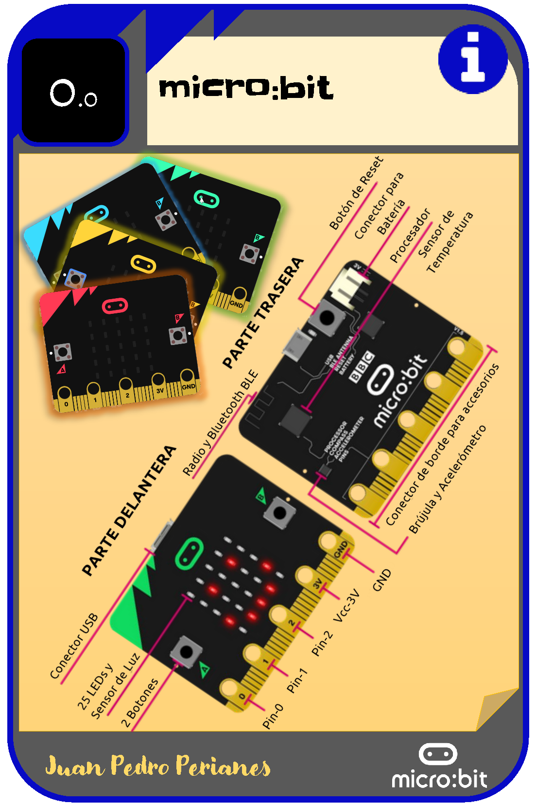

# Curso de micro:bit 

Este es un completo curso de la placa micro:bit a través de una colección de fichas y ejercicios

# Licencia

 **Aprende micro:bit** creado por Juan Pedro Perianes Rodríguez se distribuye bajo una <a rel="license" href="http://creativecommons.org/licenses/by-sa/4.0/">Licencia Creative Commons Atribución-CompartirIgual 4.0 Internacional</a>.
